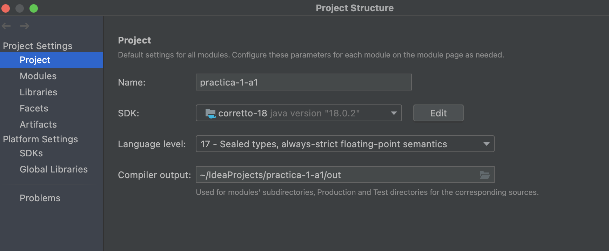

# ReadMe Pràctica 1 Grup: A1

## Descàrrega del projecte

En fer els tests als ordinadors del laboratori a classe vam poder comprovar que abans d'executar el programa s'han de fer els següents passos pel seu correcte funcionament:

* Marcar el directori src com a Sources Root:

* Marcar el directori out com a Excluded:

* Configurar l'estructura del projecte (project structures) escollint les següents opcions:

## Executable

S'han creat dos ".jar" per a executar el projecte des de la terminal. Aquests es troben a la carpeta out/artifacts del projecte pujat al campus virtual. En la carpeta Server es troba l'executable del servidor i a la carpeta Client el del client. La comanda per a executar el servidor en mode Server VS Client és el següent:

* java -jar Server.jar  -p 9999 -m 0
  * -p: port a on establir-se
  * -m: 0 per mode Client vs Servidor i 1 mode Client vs Client

Per a executar el client en local:

* java -jar Client.jar -h localhost -p 9999
  * -h: IP o nom de la màquina a on connectar-se
  * -p: port on trobar el servidor

Per a executar el servidor en mode Client VS Client:

* java -jar Server.jar -p 9999 -m 1

